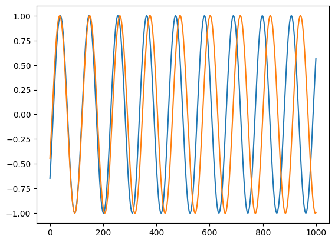

# Vibrato output
The graph below shows the output of the vibrato given a steady state sine wave.
The blue wave is an earlier snippet than the orange, with similar starting points. The deviation of the waves shows the alteration of the frequency.

